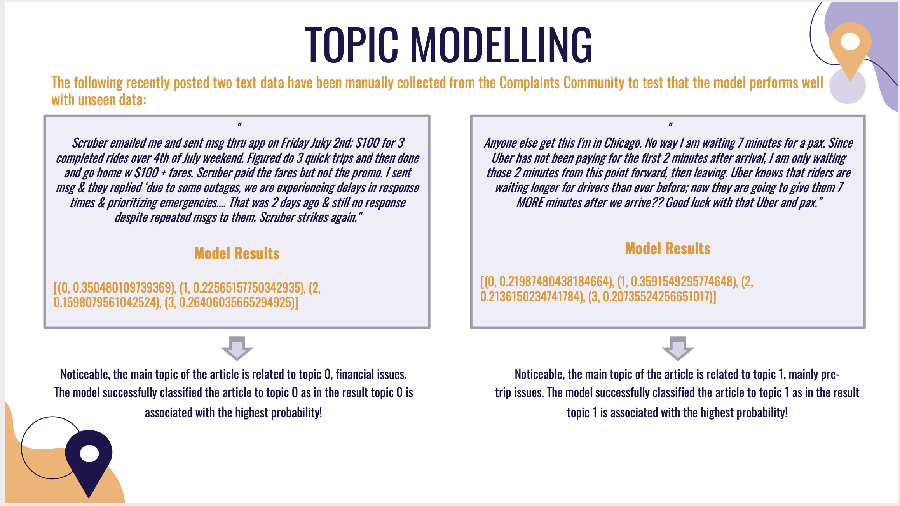
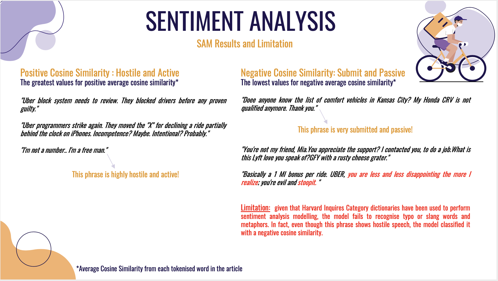

# NLP - Final Project
 NLP analysis for Uber drivers exchange in [UberPeople complaint forum](https://www.uberpeople.net/forums/Complaints/)

## Task:
* to appreciate the set of themes Uber drivers talk about
* to appreciate the affective states represented in talks among Uber drivers 
* to appreciate how themes and affective states change over time/different stages of development of Uber

## Proposed methods:
* Topic Modeling (LDA)
* Semantic Axis Method (SAM)

## Directory Structure
``` bash
nlp-ftp
├── LICENSE
├── README.md
├── data
│   ├── DF_TOPIC.pickle
│   ├── data.pickle
│   ├── df_nontokenized.pickle
│   ├── df_tokenized.pickle
│   └── inquireraugmented.xls
├── output
│   ├── cosine_hist.pdf
│   ├── sample_SAM.png
│   ├── sample_topics.png
│   ├── themes_affective_time_series.pdf
│   └── topic_modeling.pdf
├── presentation.pdf
├── requirement.txt
└── scripts
    ├── coherence_eval.py
    ├── semantic-axis-analysis.py
    ├── topic-modelling.py
    └── web-scraping-nlp.py
```
## File Description
* ```requirements.txt``` -> Required Python libraries 
* ```presentation.pdf``` -> Slideshow that shows a holistic view of the project 
### datasets
* ```data.pickle``` -> Unclean scraped texts data, including timestamp, from Uber complaint forum
* ```df_nontokenized.pickle``` -> Clean but nontokenized scraped texts data, including timestamp, from Uber complaint forum
* ```df_tokenized.pickle``` -> Clean and tokenized scraped texts data, including timestamp, from Uber complaint forum
* ```DF_TOPIC.pickle``` -> Data in a format that can be analysed by Mallet LDA (Gensim) 
* ```inquireraugmented.xls``` -> Harvard IV words (for part 2)

### scripts
* ```web-scraping-npl.py ``` -> This script focuses on extracting texts from articles in the Uber People Forums website
* ```topic-modelling.py``` -> This script focuses on applying topic modeling (LDA) on the data gathered, denoting Part 1 of the project
* ```coherence_eval.py ``` -> This script focuses on the implementation of the coherence score that statistically evaluates the number of topics
* ```semantic-axis-analysis.py ``` -> This script aims to analyse affective states represented in Uber drivers’ conversation, denoting Part 2 of the project. The method adopted to perform the analysis is the Semantic axis Method (SAM). The file also incorporates topic modelling for time-series analysis, denoting Part 3 of the project

## Sample results 

### Sample from unseen documents (LDA) 


### Top three positive and negative documents relative to chosen semantic axis ((Hostile + Active) - (Submit + Passive)) 


